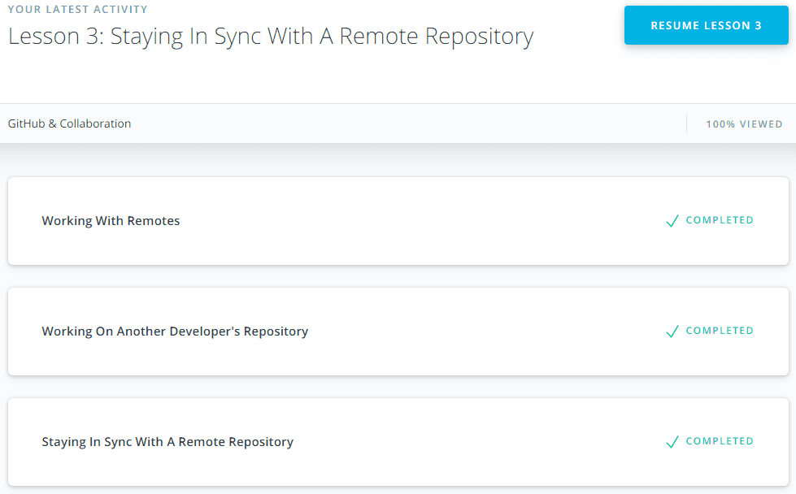

## Git Intro

name (at least) one thing that was new to you:
- Working with git in console
- Staging Index
- `git show`

name (at least) one thing that surprised you:
- `git config --global core.editor "code --wait"`

name (at least) one thing you intend to use in the future:
- `git log --oneline`
- `git log --stat`
- `git log --oneline --all --graph`

  
Udacity: Version Control with Git

  

Working with git in console is powerful. I liked `git log --oneline --all --graph` and `git log --stat` commands, but resolving conflicts in GUI much more convenient for me.

## Unix Shell
name (at least) one thing that was new to you:
- `lpr`
- `lpq`
- `lprm`

name (at least) one thing that surprised you:
- `finger` is not default(pre installed) package in Debian

name (at least) one thing you intend to use in the future (also used them before):
- `cp`
- `more`
- `grep`

  
Linux Survival

  
  
  
  

## Git Collaboration

name (at least) one thing that was new to you:
- `git shortlog`
- `git log --author=""`

name (at least) one thing that surprised you:
- `git log --grep=""`

name (at least) one thing you intend to use in the future:
- `git log --grep=""`

  
Udacity: GitHub & Collaboration

  

## NodeJS Basics 1

name (at least) one thing that was new to you:
- trampoline function implementation
- The last task of "functional javascript workshop"
- Work with crypto, tar and zlib in NodeJS

name (at least) one thing that surprised you:
- The last task of "functional javascript workshop" surprised of using `call` on `Function.prototype` and I found a new way of IIFE implementation.

name (at least) one thing you intend to use in the future:
- I think crypto module

  
Courses

  

  

  

