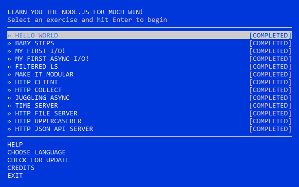

## Git Intro

name (at least) one thing that was new to you:
- Working with git in console
- Staging Index
- `git show`

name (at least) one thing that surprised you:
- `git config --global core.editor "code --wait"`

name (at least) one thing you intend to use in the future:
- `git log --oneline`
- `git log --stat`
- `git log --oneline --all --graph`

<details>
  <summary>Udacity: Version Control with Git</summary>

  
</details>

Working with git in console is powerful. I liked `git log --oneline --all --graph` and `git log --stat` commands, but resolving conflicts in GUI much more convenient for me.

## Unix Shell
name (at least) one thing that was new to you:
- `lpr`
- `lpq`
- `lprm`

name (at least) one thing that surprised you:
- `finger` is not default(pre installed) package in Debian

name (at least) one thing you intend to use in the future (also used them before):
- `cp`
- `more`
- `grep`

<details>
  <summary>Linux Survival</summary>

  
  
  
  
</details>

## Git Collaboration

name (at least) one thing that was new to you:
- `git shortlog`
- `git log --author=""`

name (at least) one thing that surprised you:
- `git log --grep=""`

name (at least) one thing you intend to use in the future:
- `git log --grep=""`

<details>
  <summary>Udacity: GitHub & Collaboration</summary>

  
</details>

## NodeJS Basics 1

name (at least) one thing that was new to you:
- trampoline function implementation
- The last task of "functional javascript workshop"
- Work with crypto, tar and zlib in NodeJS

name (at least) one thing that surprised you:
- The last task of "functional javascript workshop" surprised of using `call` on `Function.prototype` and I found a new way of IIFE implementation.

name (at least) one thing you intend to use in the future:
- I think crypto module


<details>
  <summary>Courses</summary>

  

  

  
</details>

## Memory Management
What's going to happen if program reaches maximum limit of stack ?
- We will get a stack overflow and the program will receive a Segmentation Fault.

What's going to happen if program requests a big (more then 128KB) memory allocation on heap ?
- Anonymous memory mapping will be created (it will be created in MMS, not in heap) this allocation will not correspond to any files and program can use it instead of heap.

What's the difference between Text and Data memory segments ?
- **Text Segment** maps the part of the program's binary image that contains program code and string literals. This segment is read only writes to this area earn program a Segmentation Fault.
- **Data Segment** maps the part of the program's binary image that contains the initial static values given in source code. This segment is a private memory mapping, which means that updates to memory are not reflected to binary file and program able to change variable values w/o errors.

```console
$ cat /proc/self/maps
7f06fe260000-7f06fe3f5000 r-xp 00000000 00:00 273595             /lib/x86_64-linux-gnu/libc-2.24.so
7f06fe3f5000-7f06fe3fd000 ---p 00195000 00:00 273595             /lib/x86_64-linux-gnu/libc-2.24.so
7f06fe3fd000-7f06fe5f5000 ---p 0000019d 00:00 273595             /lib/x86_64-linux-gnu/libc-2.24.so
7f06fe5f5000-7f06fe5f9000 r--p 00195000 00:00 273595             /lib/x86_64-linux-gnu/libc-2.24.so
7f06fe5f9000-7f06fe5fb000 rw-p 00199000 00:00 273595             /lib/x86_64-linux-gnu/libc-2.24.so
7f06fe5fb000-7f06fe5ff000 rw-p 00000000 00:00 0
7f06fe600000-7f06fe622000 r-xp 00000000 00:00 273573             /lib/x86_64-linux-gnu/ld-2.24.so
7f06fe622000-7f06fe623000 r-xp 00022000 00:00 273573             /lib/x86_64-linux-gnu/ld-2.24.so
7f06fe688000-7f06fe823000 r--p 00000000 00:00 274226             /usr/lib/locale/locale-archive
7f06fe823000-7f06fe824000 r--p 00023000 00:00 273573             /lib/x86_64-linux-gnu/ld-2.24.so
7f06fe824000-7f06fe825000 rw-p 00024000 00:00 273573             /lib/x86_64-linux-gnu/ld-2.24.so
7f06fe825000-7f06fe826000 rw-p 00000000 00:00 0
7f06fe8a0000-7f06fe8c2000 rw-p 00000000 00:00 0
7f06fe8d0000-7f06fe8d2000 rw-p 00000000 00:00 0
7f06fe8e0000-7f06fe8e3000 rw-p 00000000 00:00 0
7f06fea00000-7f06fea07000 r-xp 00000000 00:00 8510               /bin/cat
7f06fea07000-7f06fea08000 r-xp 00007000 00:00 8510               /bin/cat
7f06fec07000-7f06fec08000 r--p 00007000 00:00 8510               /bin/cat
7f06fec08000-7f06fec09000 rw-p 00008000 00:00 8510               /bin/cat
7fffde65d000-7fffde67e000 rw-p 00000000 00:00 0                  [heap]
7fffe5f12000-7fffe6712000 rw-p 00000000 00:00 0                  [stack]
7fffe69da000-7fffe69db000 r-xp 00000000 00:00 0                  [vdso]
```

| Segment | Address fragments |
| - | - |
| Heap    | 7fffde65d000-7fffde67e000 |
| Stack   | 7fffe5f12000-7fffe6712000 |
| MMS     | 7f06fe260000-7f06fe3f5000 |

name (at least) one thing that was new to you:
- That libs are mapped to MMS
- That Heap grows up and Stack grows down
- Text, Data and BBS segments - very interesting part read more than 5 times :)
- Segments offset randomization

name (at least) one thing that surprised you:
- Stack grows down

name (at least) one thing you intend to use in the future:
- Memory Profiles in Chrome
